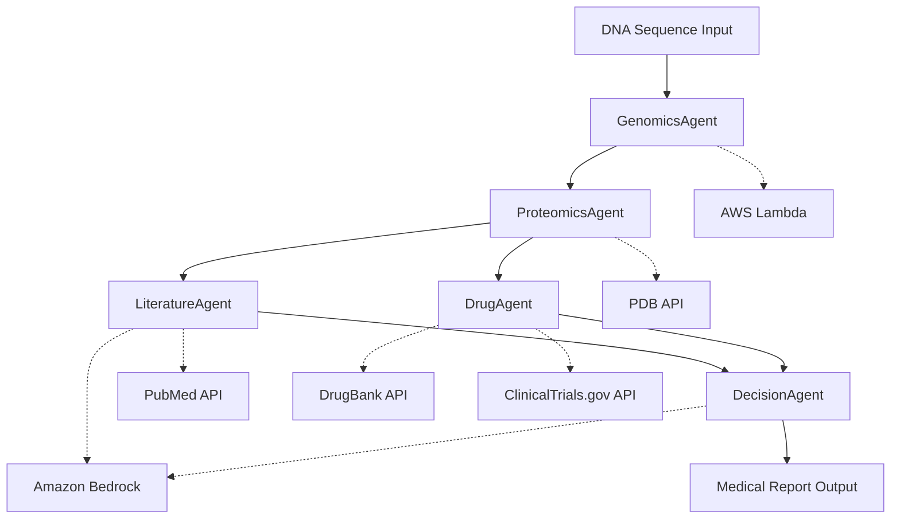
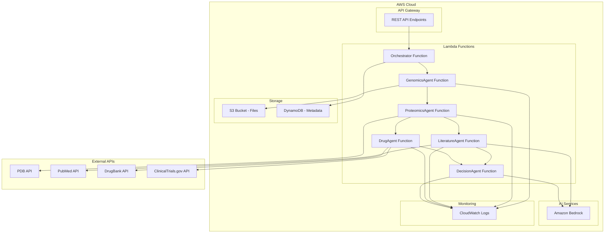

# Design Document

## Overview

Biomerkin is a cloud-native multi-agent bioinformatics system built on AWS infrastructure. The system orchestrates five specialized agents in a sequential workflow to analyze DNA sequences, predict protein structures, research literature, identify drug candidates, and generate comprehensive medical reports. The architecture leverages serverless computing, managed AI services, and external bioinformatics APIs to provide scalable, cost-effective genomic analysis.

## Architecture

### High-Level Architecture



### System Components

1. **Orchestration Layer**: Central workflow manager that coordinates agent execution
2. **Agent Layer**: Five specialized agents with distinct responsibilities
3. **Compute Layer**: AWS Lambda functions for scalable processing
4. **AI Layer**: Amazon Bedrock for LLM-powered text generation and summarization
5. **External APIs**: Bioinformatics databases and services
6. **Storage Layer**: S3 for file storage and DynamoDB for metadata
7. **Monitoring Layer**: CloudWatch for logging and monitoring

### Deployment Architecture



## Components and Interfaces

### 1. Orchestrator Service

**Purpose**: Manages workflow execution and inter-agent communication

**Key Responsibilities**:
- Workflow state management
- Agent execution coordination
- Error handling and recovery
- Result aggregation

**Interface**:
```python
class WorkflowOrchestrator:
    def start_analysis(self, dna_sequence_file: str) -> str:
        """Initiates the multi-agent analysis workflow"""
        
    def get_analysis_status(self, workflow_id: str) -> WorkflowStatus:
        """Returns current status of analysis workflow"""
        
    def get_results(self, workflow_id: str) -> AnalysisResults:
        """Retrieves final analysis results"""
```

### 2. GenomicsAgent

**Purpose**: DNA sequence analysis using Biopython

**Key Responsibilities**:
- Parse DNA sequence files (FASTA, GenBank)
- Gene identification and annotation
- Mutation detection against reference genomes
- DNA to protein translation

**Interface**:
```python
class GenomicsAgent:
    def analyze_sequence(self, sequence_file: str) -> GenomicsResults:
        """Analyzes DNA sequence for genes, mutations, and proteins"""
        
    def detect_mutations(self, sequence: str, reference: str) -> List[Mutation]:
        """Compares sequence against reference to identify mutations"""
        
    def translate_to_protein(self, dna_sequence: str) -> List[ProteinSequence]:
        """Translates DNA coding sequences to protein sequences"""
```

**Dependencies**:
- Biopython library
- Reference genome databases
- AWS Lambda runtime

### 3. ProteomicsAgent

**Purpose**: Protein structure and function analysis

**Key Responsibilities**:
- Query PDB for protein structures
- Functional annotation prediction
- Structural analysis and visualization data

**Interface**:
```python
class ProteomicsAgent:
    def analyze_protein(self, protein_sequence: str) -> ProteomicsResults:
        """Analyzes protein for structure and function"""
        
    def get_structure_data(self, protein_id: str) -> ProteinStructure:
        """Retrieves 3D structure data from PDB"""
        
    def predict_function(self, sequence: str) -> FunctionAnnotation:
        """Predicts biological function from sequence"""
```

**Dependencies**:
- PDB REST API
- UniProt API (for functional annotations)
- Structural prediction algorithms

### 4. LiteratureAgent

**Purpose**: Scientific literature research and summarization

**Key Responsibilities**:
- PubMed literature search
- Article relevance scoring
- AI-powered summarization using Bedrock

**Interface**:
```python
class LiteratureAgent:
    def search_literature(self, search_terms: List[str]) -> List[Article]:
        """Searches PubMed for relevant articles"""
        
    def summarize_findings(self, articles: List[Article]) -> LiteratureSummary:
        """Uses LLM to summarize key findings from articles"""
        
    def generate_search_terms(self, gene_data: GeneData) -> List[str]:
        """Generates optimized search terms from genomic data"""
```

**Dependencies**:
- PubMed E-utilities API
- Amazon Bedrock (Claude/Titan models)
- Text processing libraries

### 5. DrugAgent

**Purpose**: Drug discovery and clinical trial information

**Key Responsibilities**:
- Query drug databases for relevant compounds
- Clinical trial status lookup
- Drug-target interaction analysis

**Interface**:
```python
class DrugAgent:
    def find_drug_candidates(self, target_data: TargetData) -> List[DrugCandidate]:
        """Identifies potential drug candidates for given targets"""
        
    def get_trial_information(self, drug_id: str) -> TrialInformation:
        """Retrieves clinical trial status and results"""
        
    def analyze_drug_interactions(self, drugs: List[str]) -> InteractionAnalysis:
        """Analyzes potential drug-drug interactions"""
```

**Dependencies**:
- DrugBank API
- ClinicalTrials.gov API
- ChEMBL database (optional)

### 6. DecisionAgent

**Purpose**: Report generation and treatment recommendations

**Key Responsibilities**:
- Integrate findings from all agents
- Generate doctor-style medical reports
- Provide treatment recommendations

**Interface**:
```python
class DecisionAgent:
    def generate_report(self, analysis_data: CombinedAnalysis) -> MedicalReport:
        """Generates comprehensive medical report"""
        
    def recommend_treatments(self, patient_data: PatientData) -> List[Treatment]:
        """Provides treatment recommendations based on analysis"""
        
    def assess_risk_factors(self, genomic_data: GenomicData) -> RiskAssessment:
        """Evaluates genetic risk factors"""
```

**Dependencies**:
- Amazon Bedrock (for report generation)
- Medical knowledge bases
- Treatment guideline databases

## Data Models

### Core Data Structures

```python
@dataclass
class GenomicsResults:
    genes: List[Gene]
    mutations: List[Mutation]
    protein_sequences: List[ProteinSequence]
    quality_metrics: QualityMetrics

@dataclass
class Gene:
    id: str
    name: str
    location: GenomicLocation
    function: str
    confidence_score: float

@dataclass
class Mutation:
    position: int
    reference_base: str
    alternate_base: str
    mutation_type: MutationType
    clinical_significance: str

@dataclass
class ProteinSequence:
    sequence: str
    gene_id: str
    length: int
    molecular_weight: float

@dataclass
class ProteomicsResults:
    structure_data: ProteinStructure
    functional_annotations: List[FunctionAnnotation]
    domains: List[ProteinDomain]
    interactions: List[ProteinInteraction]

@dataclass
class LiteratureSummary:
    key_findings: List[str]
    relevant_studies: List[StudySummary]
    research_gaps: List[str]
    confidence_level: float

@dataclass
class DrugCandidate:
    drug_id: str
    name: str
    mechanism_of_action: str
    trial_phase: str
    effectiveness_score: float
    side_effects: List[str]

@dataclass
class MedicalReport:
    patient_id: str
    analysis_summary: str
    genetic_findings: str
    protein_analysis: str
    literature_insights: str
    drug_recommendations: List[DrugRecommendation]
    treatment_options: List[TreatmentOption]
    risk_assessment: RiskAssessment
    generated_date: datetime
```

### Workflow State Management

```python
@dataclass
class WorkflowState:
    workflow_id: str
    status: WorkflowStatus
    current_agent: str
    progress_percentage: float
    results: Dict[str, Any]
    errors: List[WorkflowError]
    created_at: datetime
    updated_at: datetime

class WorkflowStatus(Enum):
    INITIATED = "initiated"
    GENOMICS_PROCESSING = "genomics_processing"
    PROTEOMICS_PROCESSING = "proteomics_processing"
    LITERATURE_PROCESSING = "literature_processing"
    DRUG_PROCESSING = "drug_processing"
    REPORT_GENERATION = "report_generation"
    COMPLETED = "completed"
    FAILED = "failed"
```

## Error Handling

### Error Categories

1. **Input Validation Errors**: Invalid file formats, corrupted sequences
2. **API Errors**: External service failures, rate limiting, timeouts
3. **Processing Errors**: Analysis failures, insufficient data
4. **System Errors**: Lambda timeouts, memory limits, network issues

### Error Handling Strategy

```python
class ErrorHandler:
    def handle_agent_error(self, agent: str, error: Exception) -> ErrorResponse:
        """Handles errors from individual agents"""
        
    def implement_retry_logic(self, operation: Callable, max_retries: int = 3):
        """Implements exponential backoff retry logic"""
        
    def graceful_degradation(self, failed_agents: List[str]) -> PartialResults:
        """Continues workflow with available data when agents fail"""
```

### Fallback Mechanisms

- **Literature Agent**: Use cached summaries or alternative databases
- **Drug Agent**: Fall back to broader therapeutic categories
- **Proteomics Agent**: Use sequence-based predictions when structure unavailable
- **Decision Agent**: Generate reports with available data and note limitations

## Testing Strategy

### Unit Testing

- **Agent Testing**: Mock external APIs, test core logic
- **Data Model Testing**: Validate serialization/deserialization
- **Utility Function Testing**: Test helper functions and data processing

### Integration Testing

- **API Integration**: Test external service connections
- **Workflow Testing**: End-to-end workflow execution
- **Error Scenario Testing**: Test error handling and recovery

### Performance Testing

- **Load Testing**: Multiple concurrent workflows
- **Scalability Testing**: Large sequence files and datasets
- **Latency Testing**: Response time optimization

### Test Data Management

```python
class TestDataManager:
    def get_sample_dna_sequences(self) -> List[str]:
        """Returns sample DNA sequences for testing"""
        
    def get_mock_api_responses(self, service: str) -> Dict[str, Any]:
        """Returns mock responses for external APIs"""
        
    def create_test_workflow(self) -> WorkflowState:
        """Creates a test workflow with sample data"""
```

### Continuous Integration

- **Automated Testing**: Run tests on every commit
- **Code Quality**: Linting, type checking, security scanning
- **Deployment Testing**: Validate deployments in staging environment

## Security Considerations

### Data Protection

- **Encryption**: All data encrypted in transit and at rest
- **Access Control**: IAM roles and policies for service access
- **Data Retention**: Configurable data retention policies
- **Audit Logging**: Comprehensive audit trails

### API Security

- **Authentication**: API key management for external services
- **Rate Limiting**: Implement rate limiting to prevent abuse
- **Input Validation**: Strict validation of all inputs
- **Output Sanitization**: Clean outputs to prevent data leakage

### Compliance

- **HIPAA Considerations**: Handle genetic data according to privacy regulations
- **Data Sovereignty**: Ensure data processing complies with regional requirements
- **Consent Management**: Track and manage user consent for data processing

## Performance Optimization

### Caching Strategy

- **API Response Caching**: Cache external API responses
- **Computation Caching**: Cache expensive computations
- **Result Caching**: Cache final reports for similar analyses

### Parallel Processing

- **Concurrent Agent Execution**: Run LiteratureAgent and DrugAgent in parallel
- **Batch Processing**: Process multiple sequences simultaneously
- **Asynchronous Operations**: Use async/await for I/O operations

### Resource Management

- **Lambda Optimization**: Right-size Lambda functions for workload
- **Memory Management**: Optimize memory usage for large datasets
- **Connection Pooling**: Reuse connections to external services