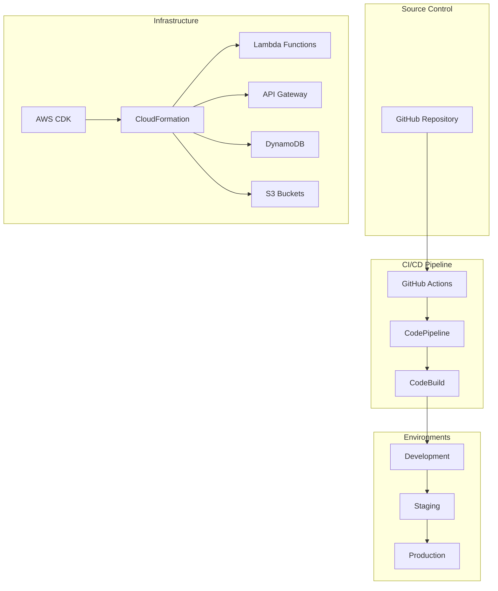
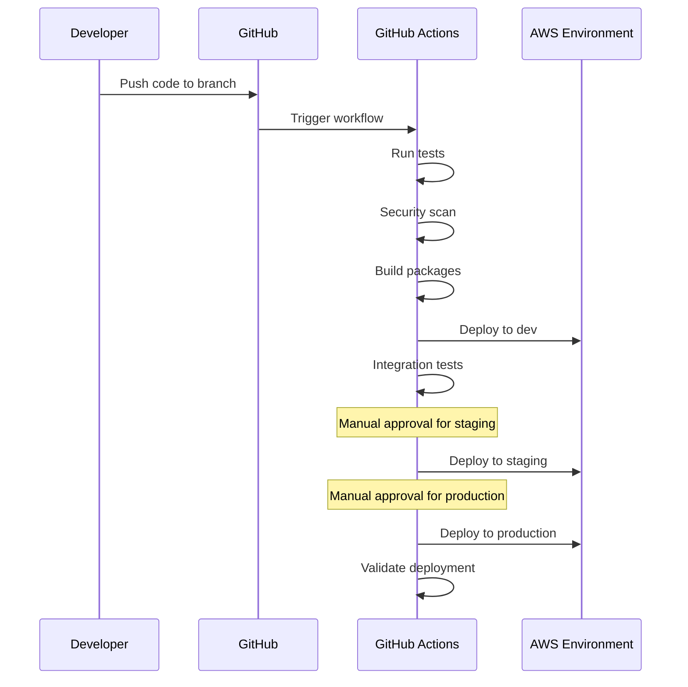

# Deployment Automation and CI/CD Pipeline

This document describes the deployment automation and CI/CD pipeline for the Biomerkin Multi-Agent System.

## Overview

The deployment automation system provides:

- **Infrastructure as Code** using AWS CDK
- **Automated CI/CD Pipeline** with GitHub Actions and AWS CodePipeline
- **Environment Management** for dev, staging, and production
- **Disaster Recovery** and rollback procedures
- **Automated Testing** and validation

## Architecture



## Components

### 1. Infrastructure as Code (CDK)

The infrastructure is defined using AWS CDK in Python:

- **Main App**: `infrastructure/app.py`
- **Core Stack**: `infrastructure/stacks/biomerkin_stack.py`
- **Pipeline Stack**: `infrastructure/stacks/pipeline_stack.py`

#### Key Features:
- Environment-specific configurations
- Automated resource tagging
- Security best practices
- Cost optimization settings

### 2. CI/CD Pipeline

#### GitHub Actions Pipeline (`.github/workflows/ci-cd.yml`)

**Stages:**
1. **Test**: Unit tests, security scans, code quality checks
2. **Build**: Package Lambda functions, synthesize CDK templates
3. **Deploy Dev**: Automatic deployment to development
4. **Deploy Staging**: Manual approval required
5. **Deploy Production**: Manual approval required

#### AWS CodePipeline

**Stages:**
1. **Source**: CodeCommit repository
2. **Test**: Automated testing with CodeBuild
3. **Package**: Lambda function packaging
4. **Deploy**: Multi-environment deployment

### 3. Environment Management

#### Environment Types

| Environment | Purpose | Features |
|-------------|---------|----------|
| **Development** | Testing and development | Minimal resources, no monitoring |
| **Staging** | Pre-production testing | Full features, monitoring enabled |
| **Production** | Live system | High availability, full monitoring, backups |

#### Environment Configuration

Each environment has:
- Separate AWS accounts (recommended) or isolated resources
- Environment-specific parameter stores
- Dedicated secrets management
- Isolated monitoring and logging

### 4. Deployment Scripts

#### Main Deployment Script (`scripts/deploy.py`)

```bash
# Deploy to development
python scripts/deploy.py dev

# Deploy to staging with validation
python scripts/deploy.py staging

# Deploy to production (requires additional approvals)
python scripts/deploy.py prod

# Skip tests (for emergency deployments)
python scripts/deploy.py dev --skip-tests

# Rollback deployment
python scripts/deploy.py dev --rollback
```

#### Environment Manager (`scripts/environment_manager.py`)

```bash
# Create new environment
python scripts/environment_manager.py create dev

# List all environments
python scripts/environment_manager.py list

# Validate environment
python scripts/environment_manager.py validate prod

# Export environment configuration
python scripts/environment_manager.py export prod config.yaml
```

## Deployment Process

### 1. Automated Deployment (GitHub Actions)



### 2. Manual Deployment

```bash
# 1. Validate environment
python scripts/environment_manager.py validate dev

# 2. Run tests
python -m pytest tests/ -v

# 3. Package Lambda functions
python scripts/package_lambdas.py

# 4. Deploy infrastructure
python scripts/deploy.py dev

# 5. Validate deployment
python scripts/validate_deployment.py dev
```

### 3. Emergency Deployment

```bash
# Skip tests for emergency deployment
python scripts/deploy.py prod --skip-tests --skip-validation

# Immediate rollback if needed
python scripts/disaster_recovery.py rollback prod <timestamp>
```

## Disaster Recovery

### Backup Strategy

#### Automated Backups
- **CloudFormation templates**: Stored in S3 with versioning
- **DynamoDB tables**: Point-in-time recovery enabled
- **Lambda functions**: Code and configuration backed up
- **Configuration**: Parameter Store and Secrets Manager

#### Backup Schedule
- **Development**: Weekly backups, 7-day retention
- **Staging**: Daily backups, 14-day retention  
- **Production**: Daily backups, 30-day retention

### Rollback Procedures

#### 1. Automated Rollback

```bash
# Create backup before deployment
python scripts/disaster_recovery.py backup prod

# Automatic rollback on deployment failure
# (handled by deployment script)
```

#### 2. Manual Rollback

```bash
# List available backups
python scripts/disaster_recovery.py list prod

# Rollback to specific backup
python scripts/disaster_recovery.py rollback prod 20241006-143022

# Validate rollback
python scripts/validate_deployment.py prod
```

#### 3. Emergency Procedures

1. **Immediate Response**
   ```bash
   # Stop traffic to affected environment
   # Scale down Lambda concurrency
   aws lambda put-provisioned-concurrency-config \
     --function-name biomerkin-orchestrator-prod \
     --provisioned-concurrency-config ProvisionedConcurrencyConfigs=0
   ```

2. **Assessment**
   ```bash
   # Check system health
   python scripts/validate_deployment.py prod
   
   # Review CloudWatch logs
   aws logs describe-log-groups --log-group-name-prefix /aws/lambda/biomerkin
   ```

3. **Recovery**
   ```bash
   # Rollback to last known good state
   python scripts/disaster_recovery.py rollback prod <last-good-timestamp>
   
   # Validate recovery
   python scripts/validate_deployment.py prod
   ```

## Security Considerations

### Deployment Security

1. **Access Control**
   - IAM roles with least privilege
   - Multi-factor authentication required
   - Separate deployment roles per environment

2. **Secrets Management**
   - AWS Secrets Manager for API keys
   - Parameter Store for configuration
   - Encryption at rest and in transit

3. **Code Security**
   - Automated security scanning (Bandit, Safety)
   - Dependency vulnerability checks
   - Code signing for Lambda packages

### Pipeline Security

1. **GitHub Actions**
   - Secrets stored in GitHub Secrets
   - Environment-specific approvals
   - Audit logging enabled

2. **AWS CodePipeline**
   - Cross-account deployment roles
   - Artifact encryption
   - CloudTrail logging

## Monitoring and Alerting

### Deployment Monitoring

1. **CloudWatch Metrics**
   - Deployment success/failure rates
   - Lambda function health
   - API Gateway performance

2. **Alarms**
   - Deployment failures
   - High error rates
   - Performance degradation

3. **Notifications**
   - SNS topics for alerts
   - Slack/email integration
   - PagerDuty for critical issues

### Health Checks

```bash
# Automated health checks
python scripts/validate_deployment.py prod

# Manual health verification
curl -X GET https://api.biomerkin.com/health
```

## Cost Optimization

### Resource Management

1. **Environment Sizing**
   - Development: Minimal resources
   - Staging: Medium resources
   - Production: Auto-scaling enabled

2. **Lifecycle Management**
   - Automatic cleanup of old artifacts
   - S3 lifecycle policies
   - Lambda function optimization

3. **Cost Monitoring**
   - CloudWatch cost alarms
   - Resource tagging for cost allocation
   - Regular cost reviews

## Troubleshooting

### Common Issues

#### 1. Deployment Failures

```bash
# Check CloudFormation events
aws cloudformation describe-stack-events --stack-name BiomerkinProd

# Check Lambda function logs
aws logs tail /aws/lambda/biomerkin-orchestrator-prod --follow

# Validate IAM permissions
aws iam simulate-principal-policy --policy-source-arn <role-arn> --action-names lambda:InvokeFunction
```

#### 2. Pipeline Issues

```bash
# Check CodePipeline execution
aws codepipeline get-pipeline-execution --pipeline-name biomerkin-cicd-pipeline

# Review CodeBuild logs
aws logs describe-log-streams --log-group-name /aws/codebuild/biomerkin-tests
```

#### 3. Environment Issues

```bash
# Validate environment configuration
python scripts/environment_manager.py validate prod

# Check resource health
python scripts/validate_deployment.py prod

# Review system metrics
aws cloudwatch get-metric-statistics --namespace AWS/Lambda --metric-name Errors
```

### Recovery Procedures

1. **Failed Deployment**
   - Automatic rollback triggered
   - Manual intervention if needed
   - Root cause analysis

2. **Performance Issues**
   - Scale up resources temporarily
   - Investigate bottlenecks
   - Optimize and redeploy

3. **Security Incidents**
   - Immediate isolation
   - Forensic analysis
   - Patch and redeploy

## Best Practices

### Development Workflow

1. **Feature Branches**
   - Create feature branches for new work
   - Automated testing on pull requests
   - Code review required

2. **Testing Strategy**
   - Unit tests for all components
   - Integration tests for workflows
   - End-to-end tests for critical paths

3. **Deployment Strategy**
   - Blue-green deployments for production
   - Canary releases for major changes
   - Immediate rollback capability

### Operations

1. **Monitoring**
   - Comprehensive logging
   - Real-time alerting
   - Regular health checks

2. **Maintenance**
   - Regular security updates
   - Performance optimization
   - Capacity planning

3. **Documentation**
   - Keep deployment docs updated
   - Document all procedures
   - Maintain runbooks

## Getting Started

### Prerequisites

1. **AWS Account Setup**
   ```bash
   # Configure AWS CLI
   aws configure
   
   # Verify access
   aws sts get-caller-identity
   ```

2. **Install Dependencies**
   ```bash
   # Install CDK
   npm install -g aws-cdk
   
   # Install Python dependencies
   pip install -r infrastructure/requirements.txt
   ```

3. **Bootstrap CDK**
   ```bash
   cd infrastructure
   cdk bootstrap
   ```

### First Deployment

1. **Create Environment**
   ```bash
   python scripts/environment_manager.py create dev
   ```

2. **Deploy Infrastructure**
   ```bash
   python scripts/deploy.py dev
   ```

3. **Validate Deployment**
   ```bash
   python scripts/validate_deployment.py dev
   ```

### Setting Up CI/CD

1. **Configure GitHub Secrets**
   - `AWS_ACCESS_KEY_ID`
   - `AWS_SECRET_ACCESS_KEY`
   - Environment-specific secrets

2. **Enable GitHub Actions**
   - Push code to trigger pipeline
   - Monitor workflow execution
   - Approve staging/production deployments

3. **Configure Notifications**
   - Set up Slack/email alerts
   - Configure PagerDuty integration
   - Test notification channels

This deployment automation system provides a robust, scalable, and secure foundation for managing the Biomerkin Multi-Agent System across multiple environments.